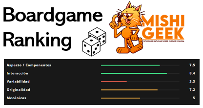

# PRÁCTICA 1
## EQUIPO
Los integrantes de esta práctica somos:
* Ignacio Such Ballester (isuch@uoc.edu)
* Andrés Fonts Santana (afontss@uoc.edu)

## WEB SCRAPING DE LA PÁGINA WEB MISHIGEEK.COM
### 1 CONTEXTO
El contexto que hemos escogido en esta práctica de Web Scraping la recopilación de valoraciones de juegos de mesa. Hemos escogido la página web www.mishigeek.com para realizar esta tarea.

MishiGeek.com contiene centenares de reseñas. En cada una se publican diveros tipos de valoraciones como "Originalidad" y "Mecánicas". También se asigna una valoración total y una clasificación cualitativa como "Suspenso", "Recomendado" o "Juegaco". 

### 2 TÍTULO
El título del dataset es **Boardgames Ranking**.

### 3 DESCRIPCIÓN DEL DATASET
El dataset Boardgames Ranking contiene N registros y NxM datos. Cada registro corresponde a un juego de mesa.

Hemos recopilado N reseñas publicadas en mishigeek y para cada una hemos identificado M atributos de interés. El formato del dataset obtenido es un fichero CSV.

### 4 REPRESENTACIÓN GRÁFICA

### 5 CONTENIDO
Cada registro de Boardgames Ranking cuenta con los siguientes campos:

| Campo     | Tipo   | Descripción                                 |
|-----------|--------|---------------------------------------------|
| nombre    | string | Nombre del juego de mesa                    |
| n_jug     | string | Número de jugadores                         |
| duracion  | string | Duración de una partida, en minutos         |
| dureza    | string | Preguntar a Mishieek                        |
| edad      | string | Edad mínima recomendada o rango de edad     |
| precio    | float  | Precio del juego en euros                   |
| genero    | string | Género al que pertenece el juego            |
| editorial | string | Editorial que publica el juego              |
| diseño    | string | Diseñadores del juego                       |
| val_asp   | float  | Valoración en cuanto Aspecto / Componentes  |
| val_inter | float  | Valoración en cuanto a nivel de Interacción |
| val_var   | float  | Valoración en cuanto Variabilidad           |
| val_org   | float  | Valoración en cuanto a Originalidad         |
| val_mec   | float  | Valoración de la Calidad de las Mecánicas   |
| val_lec   | float  | Valoración de los lectores                  |
| n_votos   | int    | Número de votos con que cuenta val_lec      |
| val_glob  | float  | Valoración global del juego                 |
| val_cual  | string | Valoración Cualitativa                      |

Los datos de nuestro dataset se han recogido de publicaciones en mishigeek.com comprendidas entre las fechas 02/10/2018 y 11/04/2022.

Hemos estructurado la solución en 3 partes:
1. Script de python que analiza las páginas de reseñas y obtiene las direcciones url de cada reseña publicada en mishigeek.com. La lista se escribe en un fichero CSV.
2. Función de python que dada una reseña obtiene cada uno de los campos
3. Script de python queitera sobre la lista de enlaces obtenida en el punto 1. y obtiene de cada enlace los campos llamando a la función definida en 2.

Hemos empleado la librería _Requests_ para acceder a las urls así como _Beautiful Soup (bs4)_ para navegar por el contenido de la url.

### 6 AGRADECIMIENTOS
Para poder realizar la tarea de _web scraping_ hemos necesitado tomar tres medidas básicas:
* Solicitar permiso a mishigeek.com para realizar la actividad.
* Consulatar _robots.txt_ de mishigeed.com y modificar la cabecera de la petición HTTP para evitar el bloqueo de mishigeek.com
* Prevenir la saturación del servidor debido a nuestras conexiones.
   * El tiempo medio entre peticiones sucesicas al servidor es de 3.5 segundos. Accedemos a cada _url_ de forma secuencial.
   * El código se estructura en dos scripts de python. En primer lugar se realiza una búsqueda de enlaces con reseñas y en segundo lugar se analizan los enlaces con reseñas para obtener el _dataset_. Así prevenimos también realizar centenares de peticiones al servidor en un espacio corto de tiempo.

Los datos recogidos son propiedad de Javier Rodríguez Menéndez, autor del blog mishigeek.com. Agradecemos la colaboración de Javier al consentir explícitamente la labor de _web scrpaing_ en su dirección web, con la condición de tratar sus datos de manera privada y no distribuirlos de forma pública.

Hemos identificado análisis similares al que presentamos en este proyecto:
* **Board Games - Kaggle**. Este _dataset_ contiene datos sobre 20.000 juegos de mesa publicados en el portal BoardGamesGeek (https://boardgamegeek.com/). El acceso al _dataset_ es abierto, publicado en Kaggle:https://www.kaggle.com/datasets/andrewmvd/board-games. Para generar el conjunto de datos han filtrado aquellos juegos publicados que tengan como mínimo 30 valoraciones de usuarios.
* **Analysis of Boardgames (Dinesh Vatvani)**. En este caso el autor del estudio ha modificado el _scrapper_ de BoardGamesGeek para explorar un _dataset_ más completo. En su blog publica un análisis muy interesante sobre miles de datos (https://dvatvani.github.io/BGG-Analysis-Part-1.html). Su proyecto de _web scrapping_ está disponible aquí: https://github.com/dvatvani/dvatvani.github.io/tree/master/static/BGG-analysis/scraper_and_data
* **Board Game Data - Kaggle**. Dataset publicado en Kaggle que contiene 5000 juegos, los datos son extraídos de BoardGamesGeek. Enlace: https://www.kaggle.com/datasets/mrpantherson/board-game-data
* **bgg-games-data - Kaggle**. Dataset de nuevo extraído de BoardGamesGeek con datos de más de 270.000 juegos de mesa. Este data set recoge datos sobre todos los juegos publicados en BoardGamesGeek hasta el 15/7/2020.

### 7 INSPIRACIÓN
Los análisis anteriores que hemos identificado se basan en el protal BoardGamesGeek (BGG). Es sin duda el mayor portal de juegos de mesa online. Nuestro dataset se basa en reseñas publicadas por MishiGeek y aporta una visión diferente a los datsets publicados. Encontramos interesante capturar qué opiniones hay fuera BGG y aportar este valor diferencial a los análisis anteriores.

Con nuestro dataset podríamos realizar análisis como:
*	Identificar los mejores juegos publicados cada año según mishigeek.
*	Saber qué editoriales de juegos de mesa tienen más éxito segun mishigeek.
*	Elaborar comparaciones entre reseñas publicadas entre diferentes portales como por ejempllo estudiar sesgos en las valoraciones.
*	Comparar precios según diferentes atributos.
* etc.

### 8 LICENCIA
El propietario de MishiGeek no ha permitido publicar los datos de forma abierta, por lo que no podemos licenciarlos. Contemplamos por eso dos supuestos:
* En el hipotético caso de que sí accediera a publicarlos escogeríamos la licencia _CC BY-NC-ND_. Esta es la más restrictiva, permite compartir los datos bajo la condición de no modificarlos ni usarlos con fines comerciales y siempre acreditando al autor/a del _dataset_.
* Generaremos un _dataset_ ficticio que compartiremos bajo la licencia _CC BY_, que permite compartir, modificar y distribuir los datos con fines comerciales y no comerciales, siempre que se acredite al autor/a.

### 9 CÓDIGO
El código utilizado puede consultarse dentro del directorio `/py` del repositorio `boardgame-reviews`.

### 10 DATASET
Hemos publicado una simulación del dataset obtenido en Zenodo 

### 11 VÍDEO
El enlace para el video se ha indicado en el documento de entrega de la práctica.
